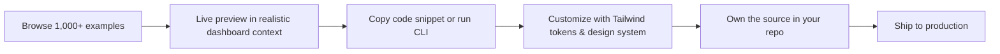
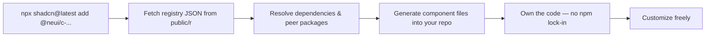
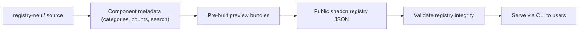
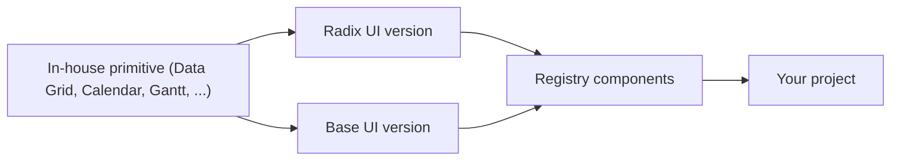
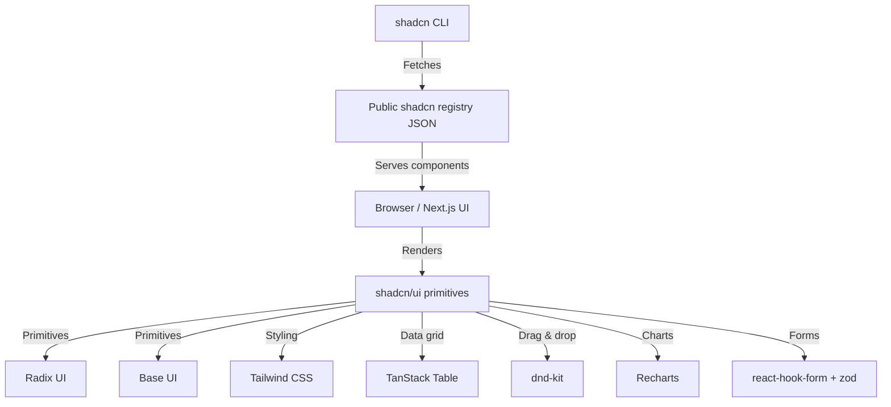

# NeUI | Design-forward shadcn/ui platform with MCP fluency for agents.

<div align="center">

```
███╗   ██╗███████╗██╗   ██╗██╗
████╗  ██║██╔════╝██║   ██║██║
██╔██╗ ██║█████╗  ██║   ██║██║
██║╚██╗██║██╔══╝  ██║   ██║██║
██║ ╚████║███████╗╚██████╔╝██║
╚═╝  ╚═══╝╚══════╝ ╚═════╝ ╚═╝
```

[](https://opensource.org/licenses/MIT)
[](https://www.typescriptlang.org/)
[](https://react.dev/)
[](https://tailwindcss.com/)

**Go beyond AI defaults and streamline high-end shadcn projects faster without touching the essentials. 1000+ free components and composed examples built with realistic dashboard layouts.**

</div>

---

## About NeUI

NeUI is a free, open-source component library for the [shadcn/ui](https://ui.shadcn.com/) ecosystem. Explore 1,000+ production-ready components across 71 categories, each shown inside realistic dashboard layouts—not isolated demos—and copy them directly into your React projects.

### Why NeUI?

- **19 In-House component primitives not in default shadcn/ui** — Data Grid, Event Calendar, Gantt, Kanban, Filters, Sortable, Timeline, Stepper, Tree, and more, built for real-world dashboard requirements
- **1000+ registry components** — Reusable examples composed from shadcn/ui primitives into real-world product flows
- **Dual Component library support** — Radix UI and Base UI versions for all 19 in-house components
- **Compatible with Shadcn Create styles and settings** — Vega, Nova, Maia, Lyra & Mira.

---

## Key Features

- **1,000+ free examples** — Production-ready, copy-paste layouts for dashboards, forms, tables, and more
- **19 In-house Components** — Custom in-house components not found in base shadcn/ui
- **Copy-and-Own Model** — No npm package, no lock-in. Own the source code in your repo
- **Dual API** — Radix UI and Base UI versions for all in-house components
- **Shadcn Compatible** — Built on shadcn primitives and Tailwind CSS
- **All Shadcn Create Themes** — Works with New York, Default, and all color token customizations
- **TypeScript** — Fully typed components and registry blocks
- **MIT License** — Free and open-source forever

---

## Custom In-House Components

NeUI provides in total: **19 custom in-house components** not found in base shadcn/ui.

---

## 🛠️ Tech Stack

<div align="center">

### Core Framework

[](https://nextjs.org/)
[](https://react.dev/)
[](https://www.typescriptlang.org/)
[](https://tailwindcss.com/)

### Component Libraries

[](https://ui.shadcn.com/)
[](https://www.radix-ui.com/)
[](https://base-ui.com/)
[](https://fumadocs.vercel.app/)

### Data & State

[](https://tanstack.com/table)
[](https://tanstack.com/virtual)
[](https://jotai.org/)
[](https://zod.dev/)

### Forms & Validation

[](https://react-hook-form.com/)
[](https://zod.dev/)

### Charts & Visualization

[](https://recharts.org/)
[](https://date-fns.org/)

### Drag & Drop

[](https://dndkit.com/)

### Icon Libraries

[](https://lucide.dev/)
[](https://tabler.io/icons)
[](https://phosphoricons.com/)
[](https://remixicon.com/)
[](https://hugeicons.com/)

### UI Utilities

[](https://cva.style/)
[](https://github.com/lukeed/clsx)
[](https://github.com/dcastil/tailwind-merge)
[](https://motion.dev/)
[](https://sonner.emilkowal.ski/)
[](https://vaul.emilkowal.ski/)

### Tooling & Infrastructure

[](https://pnpm.io/)
[](https://eslint.org/)
[](https://prettier.io/)
[](https://vercel.com/)
[](https://ui.shadcn.com/docs/cli)

</div>

---

## Getting Started

### Installation

NeUI follows the shadcn CLI approach — add blocks from the registry directly into your project (registry items use the `c-` prefix):

```bash
npx shadcn@latest add @neui/c-button-10
npx shadcn@latest add @neui/c-data-grid-9
npx shadcn@latest add @neui/c-filters-5
```

### Quick Start

1. **Copy code** — Each example includes a ready-to-use code snippet
2. **Customize** — Modify with your Tailwind CSS tokens and design system
3. **Own it** — The code lives in your repo, not a package

NeUI builds on [@tanstack/react-table](https://tanstack.com/table), [@dnd-kit/core](https://dndkit.com), [recharts](https://recharts.org), [react-hook-form](https://react-hook-form.com), [zod](https://zod.dev), and other best-in-class React libraries.

### Requirements

- **React** 18+
- **Tailwind CSS** 3+

---

## 🔄 How It Works

### Component Discovery Flow



### CLI Installation Flow



### Registry Build Pipeline



### Dual API Flow



### Architecture Overview



---

Each component page includes live examples, copy-paste snippets, CLI installation guides, TypeScript types, prop documentation, and accessibility notes.

---

## NeUI Pro

NeUI's **MCP Server** and **Agent Skill** are free for everyone — they make any AI coding agent genuinely good at building with NeUI.
A one-time license then unlocks the premium catalog on the same shadcn/ui foundation, with lifetime source ownership — **Pro** for the block library, **Ultimate** for Motion Icons and templates.

---

## Local Development

Run this repo locally to browse the catalog, edit examples, or contribute. Requires **Node.js 18+** and **pnpm**.

```bash
pnpm install
pnpm dev          # http://localhost:3000
```

### Scripts

| Script                         | Description                                                                                                                                  |
| ------------------------------ | -------------------------------------------------------------------------------------------------------------------------------------------- |
| `pnpm dev`                     | Start the dev server (uses the already-built preview bundles)                                                                                |
| `pnpm dev:packages`            | Dev server **plus** a watcher that rebuilds preview bundles on source change — use when editing example (`c-*`) or in-house primitive source |
| `pnpm build`                   | Production build (regenerates the full registry first, automatically)                                                                        |
| `pnpm start`                   | Serve the production build                                                                                                                   |
| `pnpm lint` / `pnpm typecheck` | Lint / type-check the project                                                                                                                |

### Registry build tasks

The catalog is generated from `registry-neui/` source by tools in `scripts/`. `dev`, `dev:packages`, and `build` wire these up for you — run them manually only when needed.

| Task                       | Produces / does                                                                                                      | Run it when                                                                     |
| -------------------------- | -------------------------------------------------------------------------------------------------------------------- | ------------------------------------------------------------------------------- |
| `pnpm components:build`    | Component **metadata** (categories, counts, search) under `registry-neui/_meta/`                                     | Auto on `postinstall` and before `dev` — rarely by hand                         |
| `pnpm components:packages` | The pre-built **preview bundles** (`packages/registry/bases/**/dist/`) the live previews import, plus the loader map | After a fresh clone, or after **adding / renaming / deleting component source** |
| `pnpm registry:build`      | The public **shadcn registry** JSON in `public/r/styles/**` that the CLI serves                                      | Testing `npx shadcn add @neui/...` locally                                      |
| `pnpm registry:verify`     | Validates the generated `public/r/**` registry JSON                                                                  | CI, or to sanity-check a registry build                                         |
| `pnpm registry:all`        | Full verified pipeline: metadata → packages → registry → verify                                                      | A complete rebuild from scratch                                                 |

**Which task when editing?**

- **Examples (`c-*`) or in-house primitives** (`registry-neui/…/neui/` — Data Grid, Event Calendar, Gantt, Kanban, Filters, etc.) → `pnpm dev:packages` (they're bundled, so plain `dev` shows a stale copy)
- **shadcn base primitives** (`registry/…/ui/`), site UI, `lib/`, `hooks/` → plain `pnpm dev` picks them up via Fast Refresh
- **Just running the site** → `pnpm dev`

> [!NOTE]
> Plain `pnpm dev` does **not** rebuild the preview bundles. If a bundle is missing or stale, its category page hangs while compiling (look for `Module not found: @neui/components-...` in the dev logs) — run `pnpm components:packages` and restart. If Turbopack itself panics after many rebuilds, stop the server, `rm -rf .next`, and restart.

---

## Contributing

We welcome contributions — new examples, bug fixes, documentation improvements, and component additions all help the community.

1. Fork the repository
2. Create a feature branch (`git checkout -b feature/your-change`)
3. Add your changes with TypeScript types and accessibility features
4. Open a pull request with a clear description

See [CONTRIBUTING.md](https://github.com/GiorgiKavtaradze-prog/NeUi/blob/main/CONTRIBUTING.md) for full guidelines.

---

## License

NeUI is open-source software licensed under the [MIT License](https://github.com/GiorgiKavtaradze-prog/NeUi/blob/main/LICENSE.md).

<task_progress>

- [x] Read current README.md
- [x] Analyze project structure and design
- [x] Improve README.md with Mermaid diagrams
      </task_progress>
